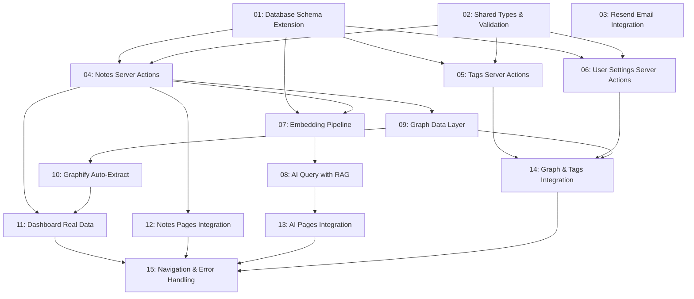

# Second Brain - Backend Logic Implementation

## Overview

Complete backend implementation for the Second Brain cyberpunk knowledge management app. All UI components are already built with mock data. This spec replaces every mock array, console.log placeholder, and hardcoded value with real database operations, server actions, AI integration (RAG with embeddings), Graphify-powered knowledge graph, and persistent settings. The app uses PostgreSQL 18 with pgvector, Drizzle ORM, Better Auth, OpenRouter for AI, Resend for email, and Next.js Server Actions.

## Quick Links

- [Requirements](./requirements.md) — full requirements and acceptance criteria
- [Action Required](./action-required.md) — manual steps needing human action

## Dependency Graph

## Waves

| Wave | Tasks | Description |
|------|-------|-------------|
| 1 | task-01, task-02, task-03 | Foundation: database schema, shared types, email integration |
| 2 | task-04, task-05, task-06 | Core CRUD: notes, tags, and user settings server actions |
| 3 | task-07, task-09 | AI pipeline: embeddings + graph data layer |
| 4 | task-08, task-10 | AI query RAG + Graphify auto-extraction |
| 5 | task-11, task-12, task-13, task-14 | UI integration: dashboard, notes, AI, graph/tags pages |
| 6 | task-15 | Polish: navigation fixes, error handling, loading states |

## Task Status

### Wave 1
- [x] [task-01-schema](./tasks/task-01-schema.md) — Database schema extension with notes, tags, graph, embeddings tables
- [x] [task-02-types](./tasks/task-02-types.md) — Shared TypeScript types, Zod schemas, and helper utilities
- [x] [task-03-email](./tasks/task-03-email.md) — Resend email integration for auth flows

### Wave 2
- [x] [task-04-notes](./tasks/task-04-notes.md) — Notes CRUD server actions with search and filters
- [x] [task-05-tags](./tasks/task-05-tags.md) — Tags CRUD server actions with usage counts
- [x] [task-06-settings](./tasks/task-06-settings.md) — User settings CRUD server actions

### Wave 3
- [ ] [task-07-embeddings](./tasks/task-07-embeddings.md) — Embedding generation pipeline with pgvector
- [ ] [task-09-graph](./tasks/task-09-graph.md) — Graph nodes and edges data layer

### Wave 4
- [ ] [task-08-rag](./tasks/task-08-rag.md) — AI query with RAG (semantic search + citations)
- [ ] [task-10-graphify](./tasks/task-10-graphify.md) — Graphify auto-extraction and graph sync

### Wave 5
- [ ] [task-11-dashboard](./tasks/task-11-dashboard.md) — Dashboard with real stats and activity
- [ ] [task-12-notes-ui](./tasks/task-12-notes-ui.md) — Notes pages wired to server actions
- [ ] [task-13-ai-ui](./tasks/task-13-ai-ui.md) — AI query and chat wired to real APIs
- [ ] [task-14-graph-ui](./tasks/task-14-graph-ui.md) — Graph canvas and tags manager wired to real data

### Wave 6
- [ ] [task-15-polish](./tasks/task-15-polish.md) — Navigation, routing, error handling, and loading states
