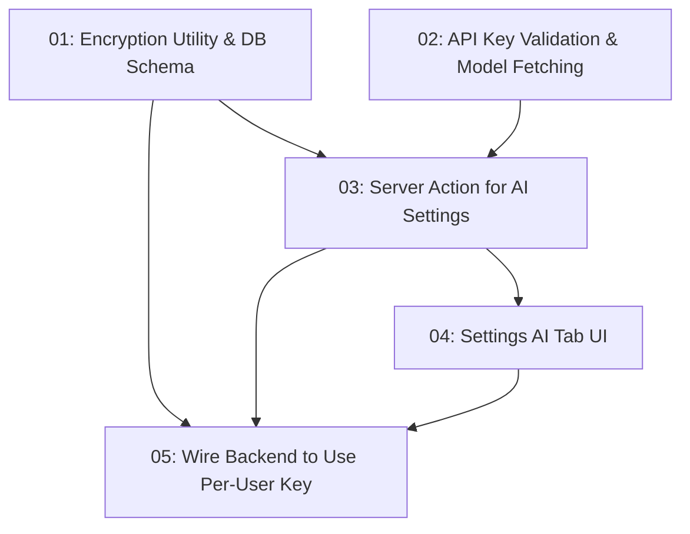

# OpenRouter Per-User API Key & Model Selection

## Overview

Allow each user to configure their own OpenRouter API key in Settings > AI. The key is AES-encrypted and stored per-user in the DB. Once validated, the user can select an embedding model (1536-dim) and an LLM model. All AI features (chat, RAG query, embeddings) use the user's own key and model preferences instead of the global env var.

## Quick Links

- [Requirements](./requirements.md) — full requirements and acceptance criteria
- [Action Required](./action-required.md) — manual steps needing human action

## Dependency Graph

## Waves

| Wave | Tasks | Description |
|------|-------|-------------|
| 1 | task-01, task-02 | Foundation: encryption utility + API key validation endpoint |
| 2 | task-03 | Server actions to save/load AI settings (depends on encryption + validation) |
| 3 | task-04 | Settings UI for API key input, validation, model selection |
| 4 | task-05 | Wire all AI backend code to use per-user key instead of env var |

## Task Status

### Wave 1
- [x] [task-01-encryption-utility](./tasks/task-01-encryption-utility.md) — AES encryption utility + ENCRYPTION_KEY env var + DB schema update
- [x] [task-02-api-key-validation](./tasks/task-02-api-key-validation.md) — Server action to validate OpenRouter key and fetch available models

### Wave 2
- [x] [task-03-ai-settings-actions](./tasks/task-03-ai-settings-actions.md) — Server actions for save/load AI settings (key, models)

### Wave 3
- [x] [task-04-settings-ai-tab-ui](./tasks/task-04-settings-ai-tab-ui.md) — Redesign AI settings tab with key input, validation, model dropdowns

### Wave 4
- [x] [task-05-wire-backend](./tasks/task-05-wire-backend.md) — Replace all `process.env.OPENROUTER_API_KEY` with per-user decrypted key
