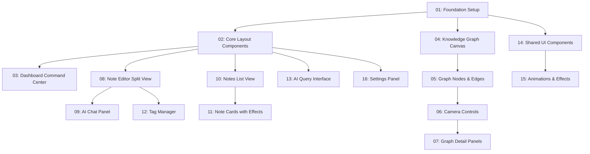

# Second Brain UI - Cyberpunk Command Center

## Overview

A personal knowledge management system with a cyberpunk aesthetic inspired by Tron and Blade Runner. The UI features a command center layout with an interactive 3D knowledge graph, markdown note editor with AI panel, and semantic AI query interface. Uses Graphify for knowledge graph extraction and visualization.

## Quick Links

- [Requirements](./requirements.md) — full requirements and acceptance criteria
- [Action Required](./action-required.md) — manual steps needing human action

## Dependency Graph

## Waves

| Wave | Tasks                     | Description                                            |
| ---- | ------------------------- | ------------------------------------------------------ |
| 1    | task-01, task-14          | Foundation setup and shared UI components              |
| 2    | task-02, task-04          | Core layout components and graph canvas initialization |
| 3    | task-03, task-05, task-10 | Dashboard, graph nodes/edges, and notes list           |
| 4    | task-06, task-08, task-13 | Camera controls, note editor, and AI query interface   |
| 5    | task-07, task-09, task-11 | Graph detail panels, AI chat panel, and note cards     |
| 6    | task-12, task-15, task-16 | Tag manager, animations/effects, and settings panel    |

## Task Status

### Wave 1

- [x] [task-01-foundation.md](./tasks/task-01-foundation.md) — Foundation setup with new dependencies and design system
- [x] [task-14-shared-ui.md](./tasks/task-14-shared-ui.md) — Shared UI components (buttons, inputs, cards, badges)

### Wave 2

- [x] [task-02-layout.md](./tasks/task-02-layout.md) — Core layout components (header, sidebar, viewport, bottom panel)
- [x] [task-04-graph.md](./tasks/task-04-graph.md) — Knowledge graph canvas initialization with React Flow

### Wave 3

- [x] [task-03-dashboard.md](./tasks/task-03-dashboard.md) — Dashboard command center main view
- [x] [task-05-graph-nodes.md](./tasks/task-05-graph-nodes.md) — Graph nodes and edges with cyberpunk effects
- [x] [task-10-notes-list.md](./tasks/task-10-notes-list.md) — Notes list view with grid/list toggle

### Wave 4

- [x] [task-06-graph-camera.md](./tasks/task-06-graph-camera.md) — Camera controls (zoom, pan, rotate) for graph
- [x] [task-08-note-editor.md](./tasks/task-08-note-editor.md) — Note editor split view with Monaco Editor
- [x] [task-13-ai-query.md](./tasks/task-13-ai-query.md) — AI query interface with input and response view

### Wave 5

- [x] [task-07-graph-panels.md](./tasks/task-07-graph-panels.md) — Graph detail panels and filter controls
- [x] [task-09-ai-panels.md](./tasks/task-09-ai-panels.md) — AI chat panel in note editor
- [x] [task-11-notes-cards.md](./tasks/task-11-notes-cards.md) — Note cards with 3D hover effects

### Wave 6

- [x] [task-12-tags-manager.md](./tasks/task-12-tags-manager.md) — Tag manager component
- [x] [task-15-animations.md](./tasks/task-15-animations.md) — Animations, particles, and visual effects
- [x] [task-16-settings.md](./tasks/task-16-settings.md) — Settings panel and theme customization
